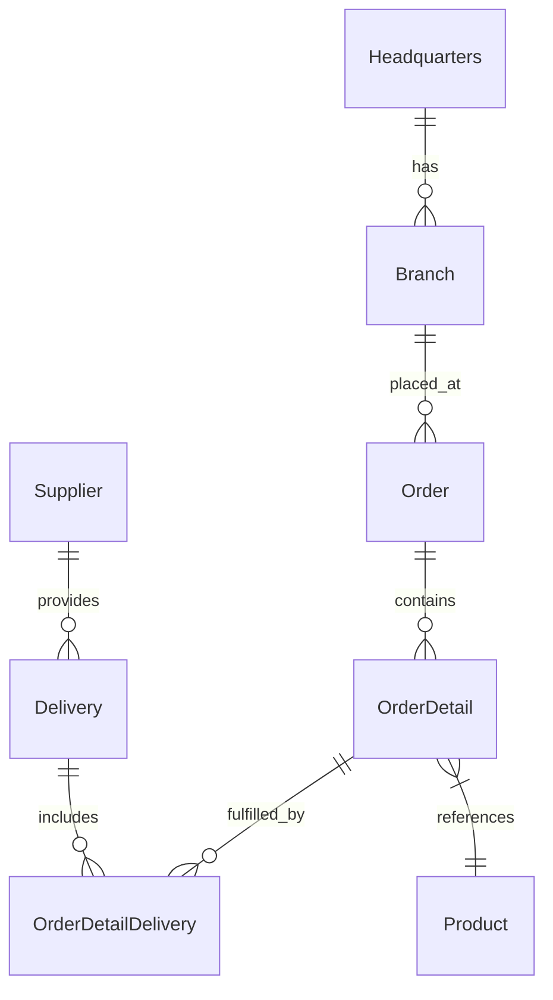

# 🚀 OctoCAT Supply: The Ultimate GitHub Copilot Workshop <$ source.version $>


Welcome to the OctoCAT Supply Website - your go-to application for learning the incredible capabilities of GitHub Copilot, GitHub Advanced Security, and the power of AI-assisted development!

Go to the [Workshop Guide](./docs/workshop-use-case-focused.md) for a step-by-step learning path.

## 🏗️ Architecture

The application is built using modern TypeScript with a clean separation of concerns:



### Tech Stack
- **Frontend**: React 18+, TypeScript, Tailwind CSS, Vite
- **Backend**: Express.js, TypeScript, SQLite, OpenAPI/Swagger
- **Data**: SQLite (file db at `api/data/app.db`; in-memory for tests)
- **DevOps**: Docker

## 🎯 Key Scenarios

1. **Vibe Coding**
   - Implement a shopping cart from a design mockup
   - Watch Copilot analyze, plan, and implement across multiple files
   - Show real-time UI updates and state management

2. **Automated Testing**
   - Generate BDD feature files
   - Create and execute Playwright tests
   - Enhance unit test coverage with intelligent test generation

3. **Security and Best Practices**
   - Scan for vulnerabilities using GHAS
   - Generate automated fixes
   - Implement security best practices with Copilot guidance

4. **DevOps Automation**
   - Generate GitHub Actions workflows
   - Create infrastructure as code
   - Set up container deployments

## 🚀 Getting Started

1. Clone this repository
2. Build the projects:
   ```bash
   # Build API and Frontend
   npm install && npm run build
   ```
3. Start the application:
   ```bash
   npm run dev
   ```

Optional: initialize the database explicitly (migrations + seed):
```bash
npm run db:init --workspace=api
```

Handy DB scripts (API workspace):
```bash
# Run migrations only
npm run db:migrate --workspace=api

# Seed data only
npm run db:seed --workspace=api
```

Or use the VS Code tasks:
- `Cmd/Ctrl + Shift + P` -> `Run Task` -> `Build All`
- Use the Debug panel to run `Start API & Frontend`

## 🛠️ MCP Server Setup (Optional)

To showcase extended capabilities:

1. Use VS Code command palette:
   - `MCP: List servers` -> `playwright` -> `Start server`
   - `MCP: List servers` -> `github-remote` -> `Start server`
2. You will be redirected to authenticate with GitHub for the GitHub Remote server.

## 📚 Documentation

- [Detailed Architecture](./docs/architecture.md)
- [SQLite Integration](./docs/sqlite-integration.md)
- [Complete Demo Script](./docs/demo-script.md)

Database defaults and env vars:
- DB file: `api/data/app.db` (override with `DB_FILE=/absolute/path/to/file.db`)
- Enable WAL: `DB_ENABLE_WAL=true` (default)
- Foreign keys: `DB_FOREIGN_KEYS=true` (default)

---

*This entire project, including the hero image, was created using AI and GitHub Copilot! Even this README was generated by Copilot using the project documentation.* 🤖✨